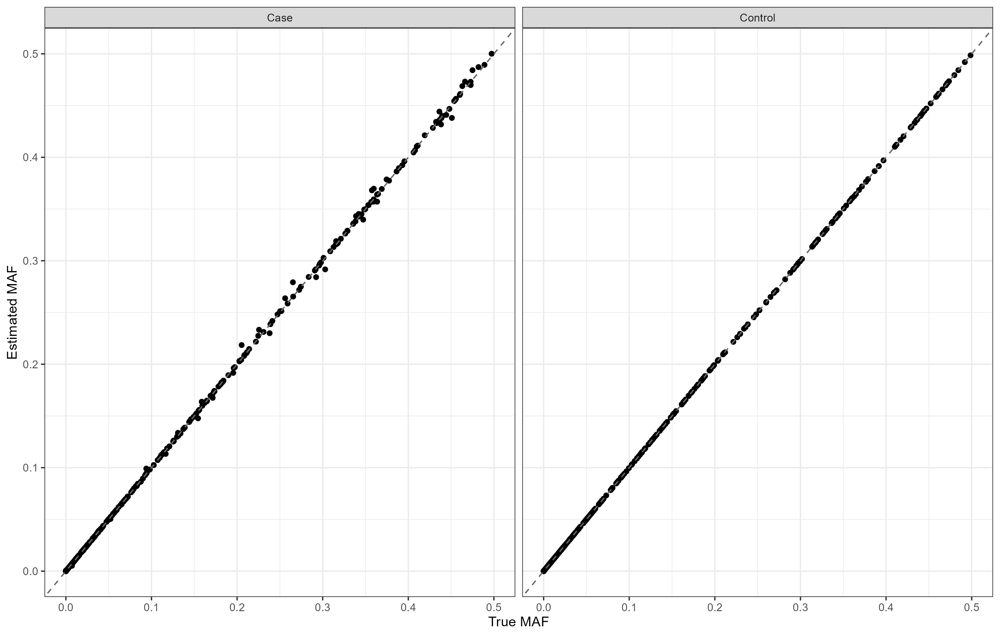

# CaseControlAF
Case Control Allele Frequency (AF) Reconstruction R Package

This repository contains the source code for the CaseControlAF R package which can be used to reconstruct the allele frequency (AF) for cases and controls separately given commonly available summary statistics. 

The package contains two functions:

1) CaseControl_AF
2) CaseControl_SE

## Download the package
To download this package using *devtools* in R:

```R
require(devtools)
devtools::install_github("https://github.com/wolffha/CaseControlAF")
```

## CaseControl_AF
Use this function when you have the following statistics (for each variant)
* Number of cases
* Number of controls
* Odds Ratio (OR) or beta coefficient
* **AF** for the whole sample (cases and controls combined)

### Usage
**N_case**: an integer for the number of case samples

**N_control**: an integer for the number of control samples

**OR**: a numeric vector with the OR (or exp(beta)) for each variant

**AF_population**: a numeric vector with the AF for each variant

Returns a dataframe with two columns: AF_case and AF_control. The number of rows is equal to the number of variants.

## CaseControl_SE
Use this function when you have the following statistics (for each variant)
* Number of cases
* Number of controls
* Odds Ratio (OR) or beta coefficient
* **SE** of the log(OR) for each variant

*Code adapted from ReACt GroupFreq function available here: (https://github.com/Paschou-Lab/ReAct/blob/main/GrpPRS_src/CountConstruct.c)*

### Usage
**N_case**: an integer for the number of case samples

**N_control**: an integer for the number of control samples

**OR**: a numeric vector with the OR (or exp(beta)) for each variant

**SE**: a numeric vector with the SE(log(OR)) for each variant

Returns a dataframe with three columns with names: MAF_case, MAF_control and MAF_pop containing the estimated minor allele frequency in the cases, controls, and whole sample. The number of rows is equal to the number of variants

**NOTE:** This method assumes we are estimating the minor allele frequency (MAF)

### Examples

See examples here: 
  geom_abline(intercept = 0, slope = 1, linetype = "dashed", color = "grey40") +
  xlab("True MAF") + ylab("Estimated MAF") +
  theme_bw() +
  facet_wrap(~status)
```

